# Entity Relationship Diagram - Healthcare IMS

Current-state ERD derived from Django models.

Last verified: 2026-03-31
Verification sources: `backend/apps/*/models.py`

```mermaid
erDiagram
    User {
        bigint id PK
        string username
        string email
        string role
        string full_name
        string nip
        bigint facility_id FK
    }

    ModuleAccess {
        bigint id PK
        bigint user_id FK
        string module
        int scope
    }

    Unit {
        bigint id PK
        string code
        string name
        text description
    }

    Category {
        bigint id PK
        string code
        string name
        int sort_order
    }

    FundingSource {
        bigint id PK
        string code
        string name
        text description
        bool is_active
    }

    Program {
        bigint id PK
        string code
        string name
        text description
        bool is_active
    }

    Location {
        bigint id PK
        string code
        string name
        text description
        bool is_active
    }

    Supplier {
        bigint id PK
        string code
        string name
        text address
        string phone
        string email
        text notes
        bool is_active
    }

    Facility {
        bigint id PK
        string code
        string name
        string facility_type
        text address
        string phone
        bool is_active
    }

    Item {
        bigint id PK
        string kode_barang
        string nama_barang
        bigint satuan_id FK
        bigint kategori_id FK
        bool is_program_item
        bigint program_id FK
        decimal minimum_stock
        text description
        bool is_active
    }

    ReceivingTypeOption {
        bigint id PK
        string code
        string name
        bool is_active
    }

    Receiving {
        bigint id PK
        string receiving_type
        string document_number
        date receiving_date
        bool is_planned
        bigint supplier_id FK
        string grant_origin
        string program
        bigint sumber_dana_id FK
        string status
        bigint created_by_id FK
        bigint verified_by_id FK
        bigint approved_by_id FK
        bigint closed_by_id FK
        datetime verified_at
        datetime approved_at
        datetime closed_at
        text closed_reason
        text notes
    }

    ReceivingOrderItem {
        bigint id PK
        bigint receiving_id FK
        bigint item_id FK
        decimal planned_quantity
        decimal received_quantity
        decimal unit_price
        bool is_cancelled
        text cancel_reason
        text notes
    }

    ReceivingItem {
        bigint id PK
        bigint receiving_id FK
        bigint order_item_id FK
        bigint item_id FK
        decimal quantity
        string batch_lot
        date expiry_date
        decimal unit_price
        bigint location_id FK
        bigint received_by_id FK
        datetime received_at
    }

    ReceivingDocument {
        bigint id PK
        bigint receiving_id FK
        string file
        string file_name
        string file_type
        datetime uploaded_at
    }

    Stock {
        bigint id PK
        bigint item_id FK
        bigint location_id FK
        string batch_lot
        date expiry_date
        decimal quantity
        decimal reserved
        decimal unit_price
        bigint sumber_dana_id FK
        bigint receiving_ref_id FK
    }

    Transaction {
        bigint id PK
        string transaction_type
        bigint item_id FK
        bigint location_id FK
        string batch_lot
        decimal quantity
        decimal unit_price
        bigint sumber_dana_id FK
        string reference_type
        int reference_id
        bigint user_id FK
        text notes
        datetime created_at
    }

    StockTransfer {
        bigint id PK
        string document_number
        date transfer_date
        bigint source_location_id FK
        bigint destination_location_id FK
        string status
        bigint created_by_id FK
        bigint completed_by_id FK
        datetime completed_at
        text notes
    }

    StockTransferItem {
        bigint id PK
        bigint transfer_id FK
        bigint stock_id FK
        bigint item_id FK
        decimal quantity
        text notes
    }

    Distribution {
        bigint id PK
        string distribution_type
        string document_number
        date request_date
        bigint facility_id FK
        string program
        string status
        bigint created_by_id FK
        bigint verified_by_id FK
        bigint approved_by_id FK
        datetime verified_at
        datetime approved_at
        date distributed_date
        text notes
        text ocr_text
    }

    DistributionItem {
        bigint id PK
        bigint distribution_id FK
        bigint item_id FK
        decimal quantity_requested
        decimal quantity_approved
        bigint stock_id FK
        text notes
    }

    Recall {
        bigint id PK
        string document_number
        date recall_date
        bigint supplier_id FK
        string status
        bigint created_by_id FK
        bigint verified_by_id FK
        bigint completed_by_id FK
        datetime verified_at
        datetime completed_at
        text notes
    }

    RecallItem {
        bigint id PK
        bigint recall_id FK
        bigint item_id FK
        bigint stock_id FK
        decimal quantity
        text notes
    }

    Expired {
        bigint id PK
        string document_number
        date report_date
        string status
        bigint created_by_id FK
        bigint verified_by_id FK
        bigint disposed_by_id FK
        datetime verified_at
        datetime disposed_at
        text notes
    }

    ExpiredItem {
        bigint id PK
        bigint expired_id FK
        bigint item_id FK
        bigint stock_id FK
        decimal quantity
        text notes
    }

    StockOpname {
        bigint id PK
        string document_number
        string period_type
        date period_start
        date period_end
        string status
        bigint created_by_id FK
        datetime completed_at
        text notes
    }

    StockOpnameItem {
        bigint id PK
        bigint stock_opname_id FK
        bigint stock_id FK
        decimal system_quantity
        decimal actual_quantity
        text notes
    }


    PuskesmasRequest {
        bigint id PK
        string document_number
        date request_date
        bigint facility_id FK
        string program
        string status
        bigint created_by_id FK
        bigint approved_by_id FK
        datetime approved_at
        text notes
        text rejection_reason
        bigint distribution_id FK
    }

    PuskesmasRequestItem {
        bigint id PK
        bigint request_id FK
        bigint item_id FK
        decimal quantity_requested
        decimal quantity_approved
        text notes
    }

    LPLPO {
        bigint id PK
        bigint facility_id FK
        int bulan
        int tahun
        string status
        string document_number
        bigint created_by_id FK
        datetime submitted_at
        bigint reviewed_by_id FK
        datetime reviewed_at
        bigint distribution_id FK
        text notes
    }

    LPLPOItem {
        bigint id PK
        bigint lplpo_id FK
        bigint item_id FK
        decimal stock_awal
        decimal penerimaan
        decimal pemakaian
        decimal stock_gudang_puskesmas
        decimal waktu_kosong
        decimal permintaan_jumlah
        text permintaan_alasan
        decimal persediaan
        decimal stock_keseluruhan
        decimal stock_optimum
        decimal jumlah_kebutuhan
        decimal pemberian_jumlah
        text pemberian_alasan
        bool penerimaan_auto_filled
    }

    User ||--o{ ModuleAccess : has
    Facility ||--o{ User : operators

    Unit ||--o{ Item : referenced_by
    Category ||--o{ Item : referenced_by
    Program ||--o{ Item : referenced_by

    Item ||--o{ Stock : tracked_in
    Location ||--o{ Stock : stores
    FundingSource ||--o{ Stock : funds
    Receiving ||--o{ Stock : source_doc

    Item ||--o{ Transaction : moved
    Location ||--o{ Transaction : location
    FundingSource ||--o{ Transaction : funding
    User ||--o{ Transaction : actor

    Supplier ||--o{ Receiving : supplier
    FundingSource ||--o{ Receiving : funding
    User ||--o{ Receiving : created_by
    User ||--o{ Receiving : verified_by
    User ||--o{ Receiving : approved_by
    User ||--o{ Receiving : closed_by
    Receiving ||--o{ ReceivingOrderItem : plans
    Receiving ||--o{ ReceivingItem : lines
    Receiving ||--o{ ReceivingDocument : documents
    Item ||--o{ ReceivingOrderItem : planned_item
    Item ||--o{ ReceivingItem : received_item
    Location ||--o{ ReceivingItem : received_location
    User ||--o{ ReceivingItem : received_by

    Facility ||--o{ Distribution : destination
    User ||--o{ Distribution : created_by
    User ||--o{ Distribution : verified_by
    User ||--o{ Distribution : approved_by
    Distribution ||--o{ DistributionItem : lines
    Item ||--o{ DistributionItem : distributed_item
    Stock ||--o{ DistributionItem : allocated_batch

    Supplier ||--o{ Recall : supplier
    User ||--o{ Recall : created_by
    User ||--o{ Recall : verified_by
    User ||--o{ Recall : completed_by
    Recall ||--o{ RecallItem : lines
    Item ||--o{ RecallItem : recalled_item
    Stock ||--o{ RecallItem : recalled_stock

    User ||--o{ Expired : created_by
    User ||--o{ Expired : verified_by
    User ||--o{ Expired : disposed_by
    Expired ||--o{ ExpiredItem : lines
    Item ||--o{ ExpiredItem : expired_item
    Stock ||--o{ ExpiredItem : expired_stock

    Location ||--o{ StockTransfer : source_location
    Location ||--o{ StockTransfer : destination_location
    User ||--o{ StockTransfer : created_by
    User ||--o{ StockTransfer : completed_by
    StockTransfer ||--o{ StockTransferItem : lines
    Stock ||--o{ StockTransferItem : source_stock
    Item ||--o{ StockTransferItem : transfer_item

    User ||--o{ StockOpname : created_by
    StockOpname ||--o{ StockOpnameItem : lines
    Stock ||--o{ StockOpnameItem : counted_stock

    Facility ||--o{ PuskesmasRequest : makes
    User ||--o{ PuskesmasRequest : created_by
    User ||--o{ PuskesmasRequest : approved_by
    PuskesmasRequest ||--o| Distribution : generates
    PuskesmasRequest ||--o{ PuskesmasRequestItem : lines
    Item ||--o{ PuskesmasRequestItem : requests

    Facility ||--o{ LPLPO : submits
    User ||--o{ LPLPO : created_by
    User ||--o{ LPLPO : reviewed_by
    LPLPO ||--o| Distribution : generates
    LPLPO ||--o{ LPLPOItem : lines
    Item ||--o{ LPLPOItem : reported
```

## Notes

- Reports app currently has no active business models.
- Many document number formats are generated in model `save()` methods when blank.
- `ModuleAccess` unique tuple is `(user, module)`.
- `Stock` unique tuple is `(item, location, batch_lot, sumber_dana)`.
- `StockOpnameItem` unique tuple is `(stock_opname, stock)`.

See `SYSTEM_MODEL.md` for extended behavioral notes and mutation checkpoints.
