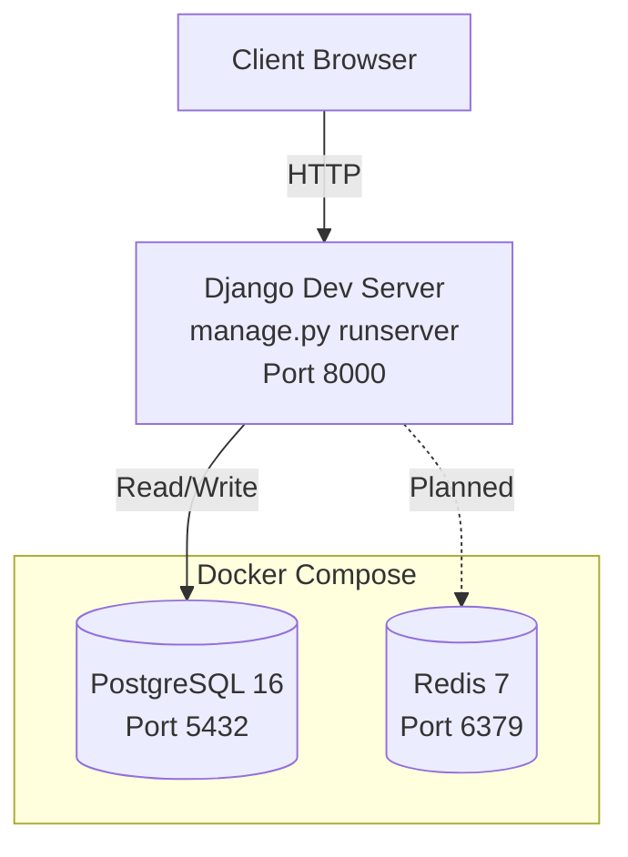
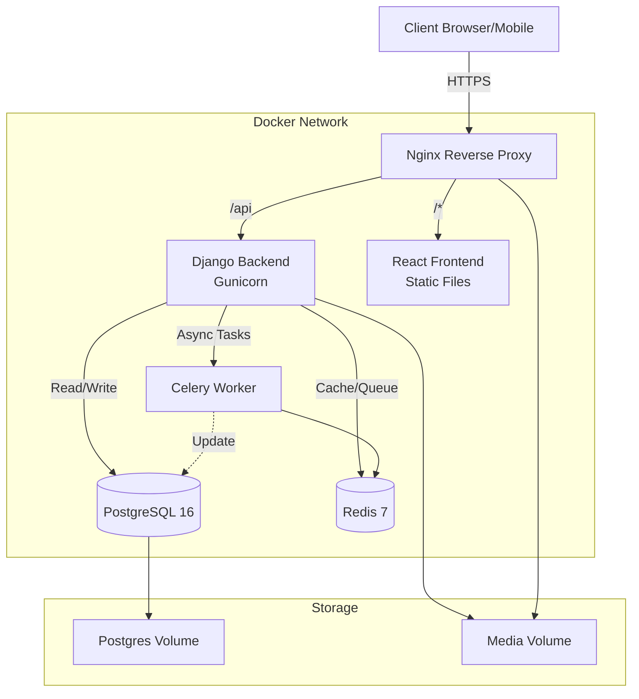

# Infrastructure Plan

## Overview

The infrastructure is designed for high reliability, ease of deployment, and seamless scalability on **Proxmox VMs (Ubuntu Server)**. We use **Docker Compose** to orchestrate services, ensuring consistency between Development and Production environments.

## Current Development Setup

The project is currently in **active development** with a simplified setup:

- **Backend**: Django 6.0.2 running natively via `python manage.py runserver` (not containerized)
- **Database**: PostgreSQL 16 via Docker Compose
- **Cache/Queue**: Redis 7 via Docker Compose (available but not actively used yet)
- **Frontend**: Django templates with Bootstrap5 (crispy-bootstrap5) — no separate frontend service
- **Celery**: Not yet running (planned for alerts/notifications)

## Target Production Architecture

> [!NOTE]
> The React frontend is **planned but not yet started**. The current UI is built with Django templates + Bootstrap5. When the React frontend is implemented, the architecture will transition to the target diagram above.

## Core Components

### 1. Servers (Proxmox VMs)

- **OS**: Ubuntu Server 22.04 LTS (or later)
- **Environment**:
  - **Development VM**: Runs with hot-reloading enabled.
  - **Production VM**: Runs optimized, static builds.

### 2. Container Orchestration (Docker Compose)

#### Current `docker-compose.yml` (Development)

Currently only infrastructure services are containerized:

- **PostgreSQL**: Database service (Port 5432)
- **Redis**: Caching and message broker (Port 6379)

#### Planned: Production Override (`docker-compose.prod.yml`)

- **Backend**: Django via **Gunicorn** (`gunicorn config.wsgi:application`).
- **Frontend**: Built static files served by **Nginx** (when React is implemented).
- **Nginx**: Reverse proxy — serves static assets, proxies `/api/` to Django, serves media files.
- **Celery**: Background task worker (expiry alerts, low stock notifications).
- **Restart Policy**: `restart: always` for high availability.

### 3. Networking & Security

- **Internal**: All services communicate on a private Docker network.
- **External**: Only **Nginx** (ports 80/443) is exposed to the host network in production.
- **CORS**: Configured to restrict API access to the frontend domain.
- **Media Files**: Served by Nginx but protected by application logic where necessary.

## Deployment Strategy

### Seamless Dev-to-Prod Workflow

1. **Develop**: Code locally or on Dev VM.
2. **Push**: Commit changes to Git.
3. **Deploy**:
    - SSH into Production VM.
    - `git pull origin main`
    - `docker compose -f docker-compose.yml -f docker-compose.prod.yml up -d --build`
    - `docker compose exec backend python manage.py migrate` (if DB changes)
    - `docker compose exec backend python manage.py collectstatic --noinput`

## Scalability

- **Horizontal**: Can add more Celery workers or Backend replicas easily via Docker Compose.
- **Vertical**: Proxmox allows resizing VM resources (CPU/RAM) on the fly.

## Backup Strategy

- **Database**: Automated `pg_dump` via scheduled cron job on the host.
- **Media Files**: RSYNC media volume to backup storage.
