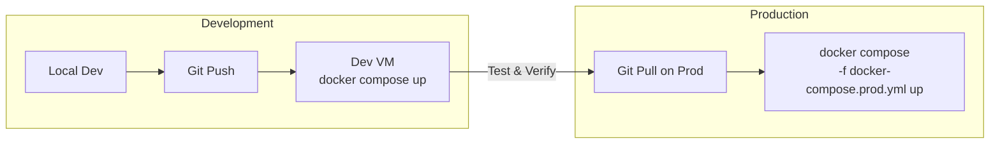
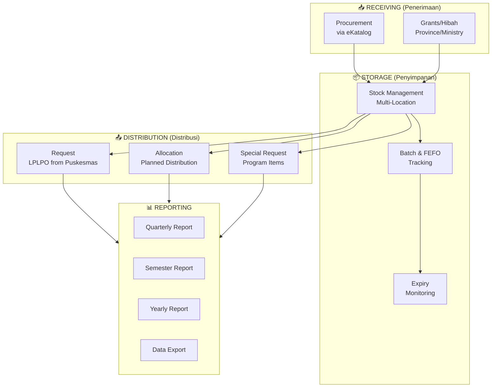

# Sistem Manajemen Inventaris Obat & Alat Kesehatan

## System Design Document

---

## 1. Executive Summary

**Purpose:** Replace Excel-based inventory management with a modern web application for managing medicine and medical equipment distribution at a government healthcare facility (Dinas Kesehatan level).

**Target Users:** 10-20 internal staff (Admin, Head of Facility, General Admin, Warehouse Staff, Accounting Staff)

### Tech Stack

| Layer | Technology | Status |
|-------|------------|--------|
| **Frontend** | Django Templates + crispy-bootstrap5 | ✅ Active |
| **Frontend (Planned)** | React + Vite + TypeScript + Tailwind CSS + shadcn/ui | ⬜ Planned |
| **Backend** | Django 6.0.2 + Django Templates | ✅ Active |
| **Database** | PostgreSQL 16 | ✅ Active |
| **Auth** | Django built-in (session-based) | ✅ Active |
| **CSV Import** | django-import-export (via Django Admin) | ✅ Active |
| **Storage** | Local filesystem (media files) | ✅ Active |
| **Deployment** | Docker Compose (PostgreSQL + Redis only) | ✅ Partial |
| **Infrastructure** | Proxmox VMs (Ubuntu Server) - Dev & Prod | ⬜ Planned |

> [!NOTE]
> The project currently uses **Django server-side rendering** with Bootstrap5 for the UI. A React frontend is planned as a future enhancement but has not been started. There is no DRF/REST API layer yet.

### Infrastructure Overview

```
┌─────────────────────────────────────────────────────────────────┐
│                  CURRENT DEVELOPMENT SETUP                       │
├─────────────────────────────────────────────────────────────────┤
│                                                                  │
│  Local Machine / Dev VM                                          │
│  ┌───────────────────────────────────────────────────────────┐  │
│  │  Django Dev Server (manage.py runserver)                   │  │
│  │  ├─ apps/items      (Item Master, Lookup Tables)          │  │
│  │  ├─ apps/stock      (Stock, Transactions)                 │  │
│  │  ├─ apps/receiving  (Penerimaan)                          │  │
│  │  ├─ apps/distribution (Distribusi)                        │  │
│  │  └─ apps/reports    (Laporan - placeholder)               │  │
│  └───────────────────────────────────────────────────────────┘  │
│                          │                                       │
│  ┌───────────────────────┴───────────────────────────────────┐  │
│  │              Docker Compose                                │  │
│  │  ├─ postgres (PostgreSQL 16)                               │  │
│  │  └─ redis    (Redis 7, available but not yet used)         │  │
│  └───────────────────────────────────────────────────────────┘  │
│                                                                  │
└─────────────────────────────────────────────────────────────────┘
```

### Dev-to-Prod Deployment Strategy



**Seamless Transition Features:**

- **Environment files:** `.env` with environment-specific values
- **Compose profiles:** `docker-compose.yml` (base) + `docker-compose.prod.yml` (overrides, planned)
- **Database migrations:** Django migrations for version-controlled schema changes
- **CORS configuration:** To be configured when REST API / React frontend is added

---

## 2. Business Process Overview



---

## 3. Core Modules

### 3.1 📥 Receiving Module (Penerimaan)

#### 3.1.1 Procurement (Pengadaan via eKatalog)

| Field | Type | Notes |
|-------|------|-------|
| No. Dokumen Pengadaan | String | From eKatalog |
| Tanggal Penerimaan | Date | |
| Supplier/Vendor | Reference | ForeignKey to Supplier |
| Sumber Dana | Reference | ForeignKey to FundingSource |
| Items | Array | Item, Qty, Batch, ED, Price |
| Dokumen Pendukung | Files | Upload from eKatalog |
| Status | Enum | Draft, Submitted, Verified |
| Notes | Text | Optional notes |

#### 3.1.2 Grants (Hibah)

| Field | Type | Notes |
|-------|------|-------|
| No. Surat Hibah | String | |
| Asal Hibah | Enum | Province, Ministry, Donation |
| Tanggal Penerimaan | Date | |
| Program | Optional | For [P] marked items |
| Sumber Dana | Reference | ForeignKey to FundingSource |
| Items | Array | Item, Qty, Batch, ED, Price |
| Dokumen Pendukung | Files | |
| Status | Enum | Draft, Submitted, Verified |
| Notes | Text | Optional notes |

---

### 3.2 📦 Stock Management (Pengelolaan Stok)

#### Item Master (Master Barang)

| Field | Type | Notes |
|-------|------|-------|
| Kode Barang | String | Auto-generated or manual |
| Nama Barang | String | |
| Satuan | ForeignKey(Unit) | Reference to Unit table |
| Kategori | ForeignKey(Category) | Reference to Category table |
| Is Program Item | Boolean | [P] marker |
| Program Name | Optional | TB, HIV, Kusta, etc. |
| Minimum Stock | Number | For alerts |

#### Unit (Satuan) - Lookup Table

| Field | Type | Notes |
|-------|------|-------|
| Code | String | TAB, KAP, SYR, BTL, AMP, VIA, etc. |
| Name | String | Tablet, Kapsul, Sirup, Botol, etc. |
| Description | Optional | Additional info |

#### Category (Kategori) - Lookup Table

| Field | Type | Notes |
|-------|------|-------|
| Code | String | TABLET, KAPSUL, INJEKSI, VAKSIN, etc. |
| Name | String | Display name |
| Sort Order | Integer | For display ordering |

#### Stock (Persediaan)

| Field | Type | Notes |
|-------|------|-------|
| Item | Reference | ForeignKey to Item |
| Location | Reference | ForeignKey to Location |
| Batch/Lot | String | |
| Expiry Date | Date | For FEFO |
| Quantity | Number | Current stock |
| Reserved | Number | Reserved for pending distributions |
| Unit Price | Decimal | |
| Sumber Dana | Reference | ForeignKey to FundingSource (stays here for per-batch tracking) |
| Receiving Ref | Reference | Link to receiving doc |

---

### 3.3 📤 Distribution Module (Distribusi)

#### 3.3.1 Request (Permintaan via LPLPO)

| Field | Type | Notes |
|-------|------|-------|
| No. LPLPO | String | From Puskesmas |
| Puskesmas | Reference | Requesting facility |
| Tanggal Permintaan | Date | |
| Items Requested | Array | Item, Qty Requested |
| Items Approved | Array | Item, Qty Approved, Batch |
| Status | Enum | Submitted → Verified → Prepared → Distributed |
| Verified By | Reference | User |
| Distributed Date | Date | |

#### 3.3.2 Allocation (Alokasi)

| Field | Type | Notes |
|-------|------|-------|
| No. Alokasi | String | |
| Periode | String | Month/Quarter |
| Type | Enum | Routine, Special |
| Allocations | Array | Facility, Item, Qty, Batch, **ED** |
| Created By | Reference | |
| Approved By | Reference | |
| Status | Enum | Draft → Approved → Distributed |

#### 3.3.3 Special Request (Permintaan Khusus)

| Field | Type | Notes |
|-------|------|-------|
| No. Permintaan | String | |
| Requesting Facility | Reference | Puskesmas, RS, Clinic |
| Program | Optional | Can be any program or none |
| Items Requested | Array | Any items (not limited to [P]) |
| Approval Status | Enum | Pending → Approved → Rejected |
| Approved By | Reference | Manual approval |
| Notes | Text | |
| OCR Text | Text | Extracted from uploaded proof |

> [!NOTE]
> Special Request currently manual process - no public-facing portal needed yet. OCR feature for proof documents.

---

### 3.4 📊 Reporting Module

#### Standard Reports

| Report | Frequency | Description |
|--------|-----------|-------------|
| Laporan Stok | On-demand | Current stock by location/category |
| Kartu Stok | On-demand | Stock card per item |
| Laporan Penerimaan | Monthly | All receiving transactions |
| Laporan Distribusi | Monthly | All distribution transactions |
| Laporan Keuangan | Quarterly/Semester/Yearly | Accounting perspective |
| Near Expiry Report | Weekly | Items expiring soon |
| Stock Opname | As needed | Physical count reconciliation |

#### Export Features

- Export to Excel (XLSX)
- Export to PDF
- Flexible date range selection
- Filter by category, sumber dana, location

> [!IMPORTANT]
> Report formats vary yearly - system must support flexible data export rather than rigid templates

---

## 4. User Roles & Permissions

| Role | Permissions |
|------|-------------|
| **Admin** | Full access, user management, system settings |
| **Kepala Instalasi** | Approve allocations, view all reports, dashboard |
| **Admin Umum** | Manage receiving, create distributions, basic reports |
| **Petugas Gudang** | Stock updates, receiving verification, distribution preparation |
| **Petugas Keuangan** | Financial reports, stock valuation, accounting exports |

---

## 5. Locations (Akan Ditentukan)

> Placeholder for warehouse/storage locations to be provided by client

| Location Code | Location Name | Notes |
|---------------|---------------|-------|
| LOC-001 | TBD | |
| LOC-002 | TBD | |
| ... | ... | |

---

## 6. System Features

### Installed Packages

```python
# requirements.txt (actual installed packages)
Django==6.0.2
django-crispy-forms==2.5
crispy-bootstrap5==2025.6
django-filter==25.1
django-import-export==4.4.0
psycopg2-binary==2.9.11
python-dotenv==1.2.1
redis==7.2.0
celery==5.6.2
gunicorn==25.1.0
tablib==3.9.0
```

### Core Features

- [x] Multi-location stock tracking
- [x] FEFO (First Expiry, First Out) management
- [x] Batch/Lot number tracking
- [x] Funding source (Sumber Dana) tracking
- [x] Program item [P] designation
- [x] Document upload/attachment
- [x] Audit trail via Transaction model (immutable stock movement log)
- [x] CSV import/export via Django Admin (`django-import-export`)
- [x] Dashboard with stock overview, near-expiry items, recent transactions
- [x] Item CRUD (list, create, update, soft delete)
- [x] Stock list with search and filters
- [x] Transaction history viewer
- [x] Receiving module (list, create, detail)
- [x] Distribution module (list, create, detail)

### Alerts & Notifications

- [ ] Low stock alerts (below minimum) — Celery periodic task
- [ ] Expiry alerts (first day of expiry month = expired) — Celery periodic task
- [ ] Pending approval notifications — Real-time via Django signals

### Dashboard

**Django Templates Dashboard (Current):**

- Stock overview (total items, total stock entries)
- Low stock items count
- Near expiry items summary (top 10, with expired flag)
- Recent transactions (top 10)

**Django Admin Panel:**

- Quick CRUD for all models
- Batch CSV imports/exports (`django-import-export`)
- User management with role-based access
- Custom admin actions
- Immutable transaction log (read-only)

---

## 7. Data Migration

Import initial data via **Django Admin** using `django-import-export`:

- Seed CSV files are in `backend/seed/`
- Import order: units → categories → funding_sources → locations → suppliers → facilities → items → stock

See [README.md](./README.md) and [seed/README.md](../backend/seed/README.md) for detailed import instructions.

---

## 8. Project Structure

```
DJANGO-IMS/
├── docker-compose.yml          # PostgreSQL + Redis services
├── .env                        # Environment variables
├── .env.example                # Template env file
│
├── backend/
│   ├── manage.py               # Django management
│   ├── requirements.txt        # Python dependencies
│   ├── config/                 # Django project settings
│   │   ├── settings.py         # Single settings file (env-driven)
│   │   ├── urls.py
│   │   ├── wsgi.py
│   │   └── asgi.py
│   ├── apps/                   # Django apps
│   │   ├── core/               # Base models (TimeStampedModel), dashboard view
│   │   ├── items/              # Item master + lookup tables (Unit, Category, etc.)
│   │   ├── stock/              # Stock management + Transaction audit trail
│   │   ├── receiving/          # Penerimaan module
│   │   ├── distribution/       # Distribusi module
│   │   ├── reports/            # Reporting module (placeholder)
│   │   └── users/              # Custom User model with roles
│   ├── seed/                   # CSV seed data files
│   ├── templates/              # Django HTML templates
│   │   ├── base.html           # Base layout (Bootstrap5)
│   │   ├── dashboard.html
│   │   ├── items/
│   │   ├── stock/
│   │   ├── receiving/
│   │   ├── distribution/
│   │   ├── reports/
│   │   └── registration/
│   └── static/                 # Static assets
│
└── requirements_draft/         # Design documents
    ├── erd.md
    ├── system_design_renew.md
    ├── infrastructure_plan.md
    └── README.md
```

### Docker Compose Configuration

**Current (`docker-compose.yml`):**

```yaml
services:
  postgres:
    image: postgres:16-alpine
    container_name: ims_postgres
    volumes:
      - postgres_data:/var/lib/postgresql/data
    environment:
      - POSTGRES_DB=healthcare_ims
      - POSTGRES_USER=postgres
      - POSTGRES_PASSWORD=postgres
    ports:
      - "5432:5432"
    restart: unless-stopped

  redis:
    image: redis:7-alpine
    container_name: ims_redis
    volumes:
      - redis_data:/data
    ports:
      - "6379:6379"
    restart: unless-stopped

volumes:
  postgres_data:
  redis_data:
```

### Development Commands

```bash
# Start infrastructure services
docker compose up -d

# Run Django dev server
cd backend
python manage.py runserver

# Run migrations
python manage.py migrate

# Create superuser
python manage.py createsuperuser

# Access Django Admin for CSV imports
# Navigate to http://localhost:8000/admin/
```

---

## 9. Resolved Questions

| Question | Resolution |
|----------|------------|
| Supplier/Vendor Management | ✅ Track beyond eKatalog |
| Puskesmas/Facility Master | ✅ 20+ facilities, access via API |
| Expiry Alert Threshold | ✅ First day of expiry month = expired |
| Stock Opname | ✅ Monthly |
| Controlled Substances | ✅ No special tracking (external ministry app) |
| Offline Access | ✅ Not needed (infra network) |
| OCR Feature | ✅ For Special Request proof documents |
| Frontend Approach | ✅ Django Templates + Bootstrap5 for now; React planned |
| CSV Import Method | ✅ `django-import-export` via Django Admin |

---

## 10. Next Steps

1. ✅ Requirements gathering — DONE
2. ✅ Tech stack finalized (Django + PostgreSQL + Docker)
3. ✅ System design approved
4. ✅ ERD created — see [erd.md](./erd.md)
5. ✅ ERD reviewed and approved
6. ✅ Django models + migrations
7. ✅ Django Admin customization (with `django-import-export`)
8. ✅ Seed data CSV templates created
9. ✅ Django template-based UI (dashboard, items, stock, receiving, distribution)
10. ⬜ Reports module implementation (currently placeholder)
11. ⬜ Celery tasks for expiry/low-stock alerts
12. ⬜ Role-based permission enforcement (middleware/decorators)
13. ⬜ Receiving verification workflow (status transitions + stock creation)
14. ⬜ Distribution workflow (FEFO batch selection, stock reservation)
15. ⬜ Excel/PDF export for reports
16. ⬜ React frontend (if/when decided)
17. ⬜ DRF REST API (if/when React frontend is started)
18. ⬜ Production Docker Compose setup
19. ⬜ Testing & deployment
